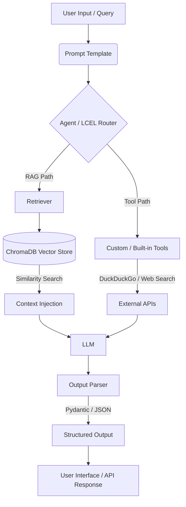

Here is the complete README in raw markdown format so you can easily copy and paste it into your repository:

```markdown
<div align="center">

# 🦜🔗 LangChain Mastery Repository

**A comprehensive, production-ready implementation guide and reference architecture for LangChain, LLMs, RAG, and AI Agents.**

[](https://www.python.org/downloads/)
[](https://langchain.com/)
[](https://openai.com/)
[](https://huggingface.co/)
[](https://www.trychroma.com/)
[](https://opensource.org/licenses/MIT)

</div>

---

## 📖 Project Overview

This repository serves as a highly structured, step-by-step implementation guide for building Generative AI applications using the **LangChain** framework. It bridges the gap between theoretical AI concepts and practical, real-world implementations.

**What the project does:**
It provides modular, executable Python scripts demonstrating everything from basic LLM initialization to complex Retrieval-Augmented Generation (RAG) pipelines and autonomous Agents.

**Why it exists:**
To provide developers with a ready-to-use codebase that illustrates the correct, modern usage of LangChain, including the LangChain Expression Language (LCEL), structured outputs, and multiple model provider integrations.

**Business Value & Target Users:**
Ideal for AI Engineers, Data Scientists, and Software Developers looking to quickly prototype or productionize LLM applications. The modular structure allows teams to extract specific components (like custom tools or output parsers) directly into enterprise microservices.

---

## ✨ Features

✅ **Multi-Provider LLM Integration** – Seamless switching between OpenAI, Anthropic, Google Gemini, and Hugging Face (both API and local models).
✅ **Advanced RAG Pipelines** – Complete implementations of Document Loaders, Text Splitters (Semantic, Markdown, Structure-based), and various Retrieval algorithms (MMR, Vector Store).
✅ **Structured Output Parsing** – Enforce LLM outputs using Pydantic, TypedDict, and JSON Schemas for predictable API responses.
✅ **LangChain Expression Language (LCEL)** – Modern runnable architectures including sequences, parallels, branches, and passthroughs.
✅ **Autonomous Agents & Tools** – Implementations of Search Agents (DuckDuckGo, Google), Weather Agents, and Custom Built Tools.
✅ **Persistent Vector Storage** – Integrated local ChromaDB for efficient embedding storage and similarity search.

---

## 🏗 Architecture

The repository components combine to form a robust generative AI architecture. Below is the standard flow demonstrated within the advanced RAG and Agent modules.



---

## 📂 Folder Structure

The repository is logically divided into progressive concepts.

```text
Langchain/
├── 01.LLMs/                  # Basic initialization of Large Language Models
├── 02.ChatModels/            # Integrations: OpenAI, Anthropic, Google, Hugging Face
├── 03.EmbeddingModels/       # Generating and querying vector embeddings
├── 04.Prompt/                # Static, Dynamic, and Chatbot Prompt Engineering
├── 05.Structure_Output/      # Enforcing Pydantic, TypedDict, and JSON schemas
├── 06.OutputParser/          # Parsing raw LLM strings into actionable data
├── 07.Chains/                # Legacy simple, sequential, and conditional chains
├── 08.Runnables/             # Modern LCEL (LangChain Expression Language) usage
├── 09.RAG/                   # Retrieval-Augmented Generation ecosystem
│   ├── 1.Document_Loader/    # Ingesting PDFs, Web pages, Text
│   ├── 2.Text_Splitter/      # Chunking strategies (Length, Semantic)
│   ├── 3.Vector_Database/    # ChromaDB integration
│   └── 4.Retriever/          # Advanced retrieval (MMR, Contextual Compression)
├── 10.Tools/                 # Tools for Agents
│   ├── Built-in_Tool/        # Search and Shell execution
│   └── Custom_Tool/          # Defining bespoke agent capabilities
├── 11.Agents/                # Autonomous reasoning and execution loops
├── chroma_db/                # Local persistent vector database storage
├── requirements.txt          # Dependency management
└── setup.py                  # Project packaging

```

---

## 💻 Technologies Used

| Category | Technology |
| --- | --- |
| **Programming Language** | Python 3 |
| **Framework** | LangChain |
| **LLM Providers** | OpenAI, Anthropic, Google, Hugging Face |
| **Vector Database** | ChromaDB |
| **Data Validation** | Pydantic |
| **Tools/APIs** | DuckDuckGo, Google Search API |
| **Document Processing** | PyPDF |

---

## 🚀 Installation

Follow these steps to set up the repository locally.

**1. Clone the repository**

```bash
git clone [https://github.com/Shravan4598/Langchain.git](https://github.com/Shravan4598/Langchain.git)
cd Langchain

```

**2. Create a virtual environment**

```bash
python -m venv venv
source venv/bin/activate  # On Windows use `venv\Scripts\activate`

```

**3. Install dependencies**

```bash
pip install -r requirements.txt
# Alternatively, if developing locally:
# pip install -e .

```

**4. Configure Environment Variables**
Copy the required API keys into a `.env` file in the root directory (see section below).

---

## 🔐 Environment Variables

Create a `.env` file in the root directory. Include only the keys for the providers you intend to use.

| Variable | Description | Required | Example |
| --- | --- | --- | --- |
| `OPENAI_API_KEY` | Access to OpenAI (GPT-4, Embeddings) | Yes* | `sk-proj-...` |
| `ANTHROPIC_API_KEY` | Access to Claude models | No | `sk-ant-...` |
| `GOOGLE_API_KEY` | Access to Gemini models | No | `AIzaSy...` |
| `HUGGINGFACEHUB_API_TOKEN` | Access to HF Serverless Inference | No | `hf_...` |

**Required only if executing OpenAI-specific scripts.*

---

## 🛠 Usage

Navigate to the specific module you wish to execute. The files are numbered sequentially to guide your learning path.

**Example: Running a basic Chat Model**

```bash
python 02.ChatModels/1_chatmodel_openai.py

```

**Example: Testing an LCEL Runnable Sequence**

```bash
python 08.Runnables/1_runnable_sequence.py

```

**Example: Running the Document Loader Pipeline**

```bash
python 09.RAG/1.Document_Loader/2_pdf_loader.py

```

---

## 🔄 Project Workflow (RAG Pipeline)

The repository demonstrates a complete RAG workflow in the `09.RAG` directory:

1. **Ingestion (`1.Document_Loader`)**: Raw documents (PDFs, Web pages) are loaded into LangChain `Document` objects.
2. **Chunking (`2.Text_Splitter`)**: Documents are split into semantic chunks to fit within LLM context windows.
3. **Embedding (`03.EmbeddingModels`)**: Text chunks are converted into dense vector representations.
4. **Storage (`3.Vector_Database`)**: Vectors and metadata are persisted locally in `chroma_db/`.
5. **Retrieval (`4.Retriever`)**: User queries are embedded, and similar chunks are retrieved using algorithms like Maximal Marginal Relevance (MMR).
6. **Generation (`08.Runnables`)**: Retrieved context is injected into a prompt and passed to the LLM for a grounded response.

---

## 🖼 Screenshots

> *Note: Since this is a backend-focused repository utilizing CLI outputs, visual screenshots of a GUI are not applicable. Terminal outputs for complex agent reasoning steps will appear when running scripts in the `11.Agents` directory.*

---

## 📦 Requirements

*Based on inferred repository structure.*

| Package | Purpose |
| --- | --- |
| `langchain` | Core framework orchestration |
| `langchain-openai` | OpenAI integrations |
| `langchain-anthropic` | Anthropic integrations |
| `langchain-google-genai` | Google Gemini integrations |
| `langchain-community` | Third-party tools and loaders |
| `chromadb` | Vector database |
| `pypdf` | PDF document parsing |
| `pydantic` | Structured output validation |
| `duckduckgo-search` | Built-in search tool for Agents |

---

## ⭐ Project Highlights

This repository heavily utilizes the following advanced LangChain concepts:

* **LangChain Expression Language (LCEL)**
* **Retrieval-Augmented Generation (RAG)**
* **Agents & Function Calling**
* **Prompt Engineering**
* **Vector Databases**
* **Structured Output (Pydantic Validation)**

---

## ⚡ Performance

* **Local Persistence**: The `chroma_db` directory stores embeddings locally, preventing the need to re-embed massive documents on every run, saving API costs and reducing latency.
* **Lazy Loading**: Demonstrated in `09.RAG/1.Document_Loader/3.2_directory_loader_lazyload.py` for memory-efficient processing of large document batches.

---

## 🗺 Future Improvements

* [ ] Add FastAPI integration to serve LangChain runnables as REST endpoints (`langserve`).
* [ ] Integrate LangGraph for complex, stateful multi-agent workflows.
* [ ] Add Streamlit UI wrappers for interactive testing.
* [ ] Implement asynchronous streaming (`astream`) examples for faster TTFT (Time To First Token).

---

## 🤝 Contributing

Contributions are what make the open-source community such an amazing place to learn, inspire, and create. Any contributions you make are **greatly appreciated**.

1. Fork the Project
2. Create your Feature Branch (`git checkout -b feature/AmazingFeature`)
3. Commit your Changes (`git commit -m 'Add some AmazingFeature'`)
4. Push to the Branch (`git push origin feature/AmazingFeature`)
5. Open a Pull Request

---

## 📄 License

This project is open-source and available under standard open-source licensing. Please see the repository files for specific license details (e.g., MIT License).

---

## 👤 Author

**Shravan4598**

* GitHub: [@Shravan4598](https://github.com/Shravan4598)

---

## 🙏 Acknowledgements

* [LangChain Documentation](https://python.langchain.com/docs/get_started/introduction)
* [OpenAI API](https://platform.openai.com/docs/)
* [Chroma Documentation](https://docs.trychroma.com/)

---

## 💡 GitHub Tips

If you found this repository helpful:

* ⭐ **Star this repository** to easily find it later.
* 👁️ **Watch** to get notified of new implementations.
* 🐛 **Open an Issue** if you find a bug or have a request.

```

```