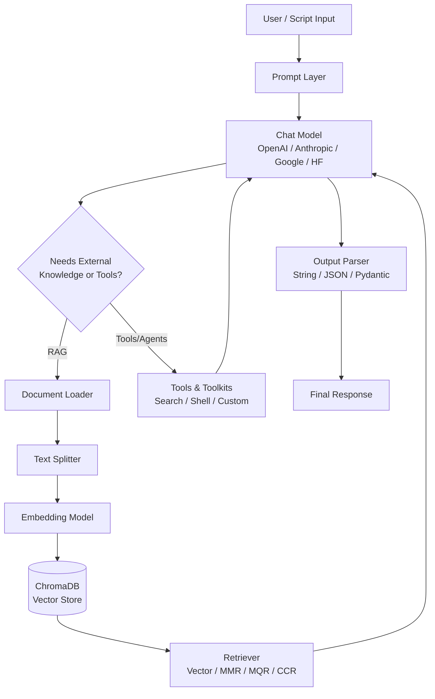

# 🦜🔗 Langchain

**A hands-on, module-by-module learning repository covering the LangChain ecosystem — from raw LLM calls to RAG pipelines, tools, and agents.**

[](https://www.python.org/)
[](https://python.langchain.com/)
[](https://www.trychroma.com/)
[](https://github.com/Shravan4598/Langchain/stargazers)
[](https://github.com/Shravan4598/Langchain/network/members)
[](https://github.com/Shravan4598/Langchain/commits)

> ⚠️ **Note on this README:** This repository was documented from its folder/file structure alone (no source code, `requirements.txt`, or `setup.py` contents were provided). Sections that cannot be verified from the file names — such as license terms, live demos, and exact dependency versions — are marked accordingly instead of being guessed.

---

## 📖 Project Overview

**Langchain** is a structured, numbered curriculum of standalone Python scripts and notebooks that walk through the LangChain framework end-to-end — starting from raw LLM invocation and progressing through chat models, embeddings, prompts, structured output, output parsers, chains, LCEL runnables, Retrieval-Augmented Generation (RAG), tools, and agents.

**Why it exists**
- Serves as a personal reference / learning log while mastering LangChain concept-by-concept.
- Each numbered folder (`01` → `11`) isolates one concept so it can be studied or reused independently.

**Real-world use case**
- A ready-made playground for anyone learning LangChain to see minimal, working examples of each building block (loaders, splitters, retrievers, chains, tools, agents) before combining them into a full application.

**Target users**
- Students and developers learning LangChain
- Engineers who want copy-paste-ready snippets for LLMs, RAG, and agent components
- Instructors looking for a ready reference curriculum structure

---

## ✨ Features

Based on the modules present in the repository:

✅ Basic LLM invocation examples (`01.LLMs`)

✅ Multi-provider chat model examples — OpenAI, Anthropic, Google, Hugging Face (API & local) (`02.ChatModels`)

✅ Embedding generation with OpenAI and local Hugging Face models, plus a document similarity demo (`03.EmbeddingModels`)

✅ Static & dynamic prompts, chat templates, message placeholders, and a simple chatbot (`04.Prompt`)

✅ Structured output using `TypedDict`, `Pydantic`, and JSON Schema (`05.Structure_Output`)

✅ Output parsers — string, JSON, structured, and Pydantic parsers, including chain integration (`06.OutputParser`)

✅ Chain compositions — simple, sequential, parallel, and conditional chains (`07.Chains`)

✅ LCEL / Runnables — `RunnableSequence`, `RunnableParallel`, `RunnablePassthrough`, `RunnableLambda`, `RunnableBranch`, plus legacy `LLMChain`, a PDF reader, and a `RetrievalQA` chain example (`08.Runnables`)

✅ End-to-end RAG pipeline:
  - Document loaders — text, PDF, directory (eager & lazy), web page (`09.RAG/1.Document_Loader`)
  - Text splitters — length-based, structure-based, markdown-based, and semantic chunking (`09.RAG/2.Text_Splitter`)
  - Vector storage with **ChromaDB** (`09.RAG/3.Vector_Database`)
  - Retrievers — Wikipedia, vector store, MMR, multi-query, and contextual compression retrievers (`09.RAG/4.Retriever`)

✅ Tool usage — built-in tools (DuckDuckGo search, shell tool, Google search), custom tools (structured & base tool), and toolkits with tool binding/execution (`10.Tools`)

✅ Agents — a search agent and a weather agent built with LangChain (`11.Agents`)

---

## 🏗️ Architecture

The repository doesn't ship a single application — it's a set of independent modules. The conceptual flow a learner follows (and the flow a RAG-based script in this repo implements) looks like this:



---

## 📂 Folder Structure


```
Langchain.git/
├── .gitignore
├── 01.LLMs/
│   ├── 1_LLM_demo.py
│   └── __init__.py
├── 02.ChatModels/
│   ├── 1_chatmodel_openai.py
│   ├── 2_chatmodel_anthropic.py
│   ├── 3_chatmodels_google.py
│   ├── 4_chatmodels_hf_api.py
│   ├── 5_chatmodels_hf_local.py
│   └── __init__.py
├── 03.EmbeddingModels/
│   ├── 1_embedding_openai_query.py
│   ├── 2_embedding_openai_docs.py
│   ├── 3_embedding_hf_local.py
│   ├── 4_Document_Similarity.py
│   └── __init__.py
├── 04.Prompt/
│   ├── 1_Static_Prompt.py
│   ├── 2_Dynamic_Prompt.py
│   ├── 3_Chatbot.py
│   ├── 4_Messages.py
│   ├── 5_Chat_Template.py
│   ├── 6_Message_Placeholder.py
│   └── chat_history.txt
├── 05.Structure_Output/
│   ├── 1_using_TypeDict.py
│   ├── 2_with_structured_output_TypeDictAnnoted.py
│   ├── 3_Pydantic.py
│   ├── 4_Pydantic.py
│   ├── 5_with_structured_output_TypeDict.py
│   ├── 6_with_structured_output_Pydantic.py
│   ├── 7_with_structured_output_JsonScheme.py
│   ├── 8_with_structure_output_using_hf.py
│   └── json_schema.json
├── 06.OutputParser/
│   ├── 1_string_output_parser.py
│   ├── 2_string_output_parser.py
│   ├── 3_json_output_parser.py
│   ├── 4_json_output_parser_with_chain.py
│   ├── 5_structured_ouput_parser.py
│   └── 6_pydantic_output_parser.py
├── 07.Chains/
│   ├── 1_simple_chain.py
│   ├── 2_sequential_chain.py
│   ├── 3_parallel_chain.py
│   └── 4_conditional_chain.py
├── 08.Runnables/
│   ├── 1.1_runnable_sequence.py
│   ├── 1_runnable_sequence.py
│   ├── 2_runnable_parallel.py
│   ├── 3.1_simple_runnable_passthrough.py
│   ├── 3.2_runnable_passthrough.py
│   ├── 4.1_simple_runnable_lambda.py
│   ├── 4.2_runnable_lambda.py
│   ├── 5_runnable_branch.py
│   ├── 6_LCEL.py
│   ├── llm_using_llmchain.py
│   ├── pdf_reader.py
│   ├── retrievalQA_chain.py
│   └── simple_llm.py
├── 09.RAG/
│   ├── 1.Document_Loader/
│   │   ├── 1_text_loader.py
│   │   ├── 2_pdf_loader.py
│   │   ├── 3.1_directory_loader_load.py
│   │   ├── 3.2_directory_loader_lazyload.py
│   │   ├── 4.1_WebPage_loader.py
│   │   ├── 4.2_WebPage_loader_application.py
│   │   ├── cricket.txt
│   │   └── pypdf.pdf
│   ├── 2.Text_Splitter/
│   │   ├── 1.1_length_based_text_splitter.py
│   │   ├── 1_length_based_text_splitter.py
│   │   ├── 2_text_structure_based_text_splitter.py
│   │   ├── 3.1_markdown_splitter_using_text_splitter.py
│   │   ├── 3_document_structure_based_text_splitter.py
│   │   └── 4_semantic_meaning_based_text_splitter.py
│   ├── 3.Vector_Database/
│   │   ├── 1_chromadb_vector_db.py
│   │   └── 2_chromadb-using-vector-database.ipynb
│   ├── 4.Retriever/
│   │   ├── 1_wikipedia_retriever.py
│   │   ├── 2_vector_store_retriever.py
│   │   ├── 3_MMR_retriever.py
│   │   ├── 4_mqr.py
│   │   └── 5_ccr.py
│   ├── Book/
│   │   ├── 1.pdf
│   │   ├── SDG_AI-Study-Assistant_Shravan-Kumar-Pandey.pdf
│   │   └── aknowledgement6th sem.pdf
│   ├── __ini__.py
│   └── dl-curriculum.pdf
├── 10.Tools/
│   ├── Built-in_Tool/
│   │   ├── 1_duckduckgo_search.py
│   │   ├── 2_shell_tool.py
│   │   └── 3_google_search.py
│   ├── Custom_Tool/
│   │   ├── 1_custom-tool.ipynb
│   │   ├── 2_structured_tool.py
│   │   └── 3_Base_tool.py
│   ├── Toolkit/
│   │   ├── 1_toolkit.py
│   │   ├── 2_tool_binding.py
│   │   ├── 3_tool_execution.py
│   │   └── 4_complete_toolkit_code.py
│   └── __init__.py
├── 11.Agents/
│   ├── 1_search_agents_in_langchain.py
│   └── 2_weather_agent_langchain.py
├── README.md
├── chroma_db/
│   ├── 710c71c9-f247-4be4-a4cb-ddd48b7c3de1/
│   │   ├── data_level0.bin
│   │   ├── header.bin
│   │   ├── length.bin
│   │   └── link_lists.bin
│   └── chroma.sqlite3
├── requirements.txt
└── setup.py

```


---

## 🛠️ Technologies Used

| Category | Technology |
|---|---|
| **Language** | Python |
| **Core Framework** | LangChain |
| **LLM Providers** | OpenAI, Anthropic, Google, Hugging Face (Inference API & local) |
| **Embedding Models** | OpenAI Embeddings, Hugging Face (local) Embeddings |
| **Vector Database** | ChromaDB |
| **Data Sources** | Wikipedia, PDF files, plain text, web pages |
| **Structured Output / Validation** | Pydantic, `TypedDict`, JSON Schema |
| **Built-in Tools** | DuckDuckGo Search, Shell Tool, Google Search |
| **Notebook Support** | Jupyter Notebooks (`.ipynb`) |
| **Packaging** | `requirements.txt`, `setup.py` |

> Exact package versions could not be determined — see [`requirements.txt`](./requirements.txt) in the repository for the authoritative list.

---

## ⚙️ Installation

```bash
# 1. Clone the repository
git clone https://github.com/Shravan4598/Langchain.git
cd Langchain

# 2. Create and activate a virtual environment
python -m venv venv
source venv/bin/activate      # On Windows: venv\Scripts\activate

# 3. Install dependencies
pip install -r requirements.txt

# 4. Configure environment variables
cp .env.example .env          # create this file if not already present
# then fill in your API keys (see table below)

# 5. Run any module script directly, e.g.:
python 01.LLMs/1_LLM_demo.py
```

---

## 🔑 Environment Variables

The scripts call multiple LLM/embedding providers and external search tools. Based on the modules present, you will likely need some or all of the following keys (add only the ones relevant to the script you're running):

| Variable | Description | Required | Example |
|---|---|---|---|
| `OPENAI_API_KEY` | API key for OpenAI chat & embedding models | For OpenAI scripts | `sk-...` |
| `ANTHROPIC_API_KEY` | API key for Anthropic (Claude) chat models | For Anthropic scripts | `sk-ant-...` |
| `GOOGLE_API_KEY` | API key for Google (Gemini) chat models | For Google scripts | `AIza...` |
| `HUGGINGFACEHUB_API_TOKEN` | Token for Hugging Face Inference API models | For HF API scripts | `hf_...` |

> ℹ️ A `.env` file / dotenv pattern is assumed based on standard LangChain conventions; confirm the exact variable names used by checking each script's `os.getenv(...)` calls, since these were not visible in the provided structure.

---

## 🚀 Usage

Each numbered folder is self-contained — pick a concept and run the corresponding script:

```bash
# Try a basic chat model call
python 02.ChatModels/2_chatmodel_anthropic.py

# Run a text splitter demo
python 09.RAG/2.Text_Splitter/2_text_structure_based_text_splitter.py

# Build/query the Chroma vector store
python 09.RAG/3.Vector_Database/1_chromadb_vector_db.py

# Run an agent example
python 11.Agents/2_weather_agent_langchain.py
```

For notebook-based examples (`.ipynb` files), launch Jupyter:

```bash
jupyter notebook
```

---

## 🔄 How It Works (RAG Module Example)

```
User Query
   ↓
Document Loader (PDF / Text / Web / Directory)
   ↓
Text Splitter (chunking)
   ↓
Embedding Model (OpenAI / Hugging Face)
   ↓
ChromaDB (vector storage)
   ↓
Retriever (Vector / MMR / Multi-Query / Contextual Compression)
   ↓
Chat Model (LLM generates the final answer)
   ↓
Output Parser → Response
```

---

## 🌟 Project Highlights

Concepts actually implemented in this repository:

- **LangChain Expression Language (LCEL)** — `RunnableSequence`, `RunnableParallel`, `RunnablePassthrough`, `RunnableLambda`, `RunnableBranch`
- **Retrieval-Augmented Generation (RAG)** — full loader → splitter → embedding → vector store → retriever pipeline
- **Prompt Engineering** — static/dynamic prompts, chat prompt templates, message placeholders
- **Structured Output** — `TypedDict`, Pydantic models, JSON Schema
- **Output Parsing** — string, JSON, structured, and Pydantic parsers
- **Embeddings & Vector Search** — OpenAI & Hugging Face embeddings with ChromaDB, including MMR-based diversity retrieval
- **Tools & Toolkits** — built-in (DuckDuckGo, Shell, Google Search) and custom tools, with tool binding/execution
- **Agents** — search agent and weather agent

---

## 📦 Requirements

| File | Purpose |
|---|---|
| `requirements.txt` | Python package dependencies (exact contents not provided — install via `pip install -r requirements.txt`) |
| `setup.py` | Enables installing this repo as a local package |

---

## 🗺️ Future Improvements

- [ ] Add a top-level `.env.example` documenting all required API keys
- [ ] Add a `LICENSE` file to clarify usage terms
- [ ] Add unit tests for reusable components (loaders, splitters, parsers)
- [ ] Consolidate common utilities used across modules to reduce duplication
- [ ] Add a consolidated `requirements.txt` with pinned versions per module

---

## 🤝 Contributing

Contributions are welcome!

1. Fork the repository
2. Create a feature branch: `git checkout -b feature/your-feature`
3. Commit your changes: `git commit -m "Add: your feature"`
4. Push to the branch: `git push origin feature/your-feature`
5. Open a Pull Request

Please keep new examples consistent with the existing numbered-module structure.

---

## 📄 License

No `LICENSE` file was present in the provided repository structure. Please check the repository directly, or add one (e.g., MIT) to clarify usage terms for contributors and users.

---

## 👤 Author

**Shravan Kumar Pandey**

- 📧 Email: shravankumarpandey825412@gmail.com
- 🔗 Portfolio: shravan-kumar-pandey-portfolio.vercel.app
- 💼 LinkedIn: Shravan Kumar Pandey
- 🏆 Kaggle / LeetCode: shravankumarpandey

---

## 🙏 Acknowledgements

- [LangChain](https://python.langchain.com/) — the core framework this repository is built around
- [ChromaDB](https://www.trychroma.com/) — vector database used for RAG examples
- OpenAI, Anthropic, Google, and Hugging Face — model providers integrated across the modules

---

## ❓ FAQ

<details>
<summary><b>Is this a production application?</b></summary>
No — it's a structured, module-by-module learning repository of standalone LangChain examples, not a deployable application.
</details>

<details>
<summary><b>Do I need API keys for every provider?</b></summary>
No. You only need the API key(s) corresponding to the specific script/provider you're running (e.g., only `OPENAI_API_KEY` for OpenAI scripts).
</details>

<details>
<summary><b>Where is the vector store data stored?</b></summary>
Locally, in the <code>chroma_db/</code> directory, generated when you run the ChromaDB examples in <code>09.RAG/3.Vector_Database</code>.
</details>

---

## 🐛 Troubleshooting

| Issue | Likely Cause | Fix |
|---|---|---|
| `AuthenticationError` / `401` | Missing or invalid API key | Verify the relevant key is set in your `.env` and loaded correctly |
| `ModuleNotFoundError` | Dependencies not installed | Run `pip install -r requirements.txt` inside your virtual environment |
| Chroma errors on rerun | Stale `chroma_db/` state | Delete the `chroma_db/` folder and re-run the ingestion script |
| PDF loader fails | Corrupt or unsupported PDF | Confirm the PDF opens normally outside the script; try a different loader |

---

## 🔒 Security Notes

- **Never commit real API keys.** Store them in a `.env` file and ensure `.env` is listed in `.gitignore`.
- The repository's `.gitignore` is present at the root — confirm it excludes `.env`, `__pycache__/`, and virtual environment folders.
- Treat `chroma_db/` as generated/local data; avoid committing large binary vector store files to version control.

---

## ⭐ GitHub Tips

If you find this repository useful:

- ⭐ **Star** the repo to bookmark it
- 🍴 **Fork** it to build your own LangChain learning path
- 🐛 Open an **Issue** for bugs or suggestions
- 🔀 Submit a **Pull Request** to add new examples
- 👀 **Watch** the repo for updates
